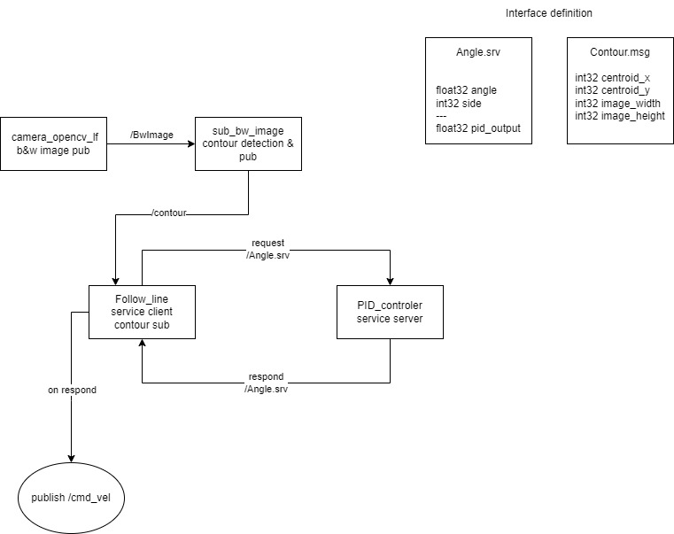

# information

<p align="center">
    
</p>


# installation prerequis

- ROS2 Humble
- Gazebo
- ros-humble-gazebo-ros-pkgs
- Xacro

# installation

`sudo apt install gazebo`
`sudo apt install ros-humnle-gazebo-ros-pkgs`
`sudo apt install ros-humnle-xacro`

# TODO

- find better pid values
- get contour with the biggest area  [ done ]
- add light automatically in the gazebo environement

# misc

create package:
ros2 pkg create linefollower

build:
cd ros2_ws
colcon build

gazebo :
- https://classic.gazebosim.org/tutorials?tut=ros2_installing&cat=connect_ros#InstallROS2

```
sudo apt install ros-humble-gazebo-ros-pkgs
```

Our ros Package :


URDF robot creation :

create a robot model:
https://docs.ros.org/en/humble/Tutorials/Intermediate/URDF/Building-a-Visual-Robot-Model-with-URDF-from-Scratch.html

- clone this repo https://github.com/joshnewans/my_bot this a template for creating urdf xacro robots in ros2
- create the robot joint and link using xacro to generate the XML URDF file


to build :
colcon build --symlink-install

to launch our urdf use : 
ros2 launch bocchi_bot rsp.launch.py

Run the created robot in Gazebo :

launch urdf in gazeboas it is
 - launch robot_state_publisher in sim mode
 - launch gazebo with ROS compatibility
 - spawn robot in gazebo with spawn script

 
we need to launch with simulation time so it works well in gazebo

launch robot_state_publisher in sim mode : 
ros2 launch bocchi_bot rsp.launch.py use_sim_timem:=true

launch gazebo with ROS compatibility :
sudo apt install ros-<distro>-gazebo-ros-pkgs
ros2 launch gazebo_ros gazebo.launch.py

spawn robot in gazebo with spawn script :
ros2 run gazebo_ros spawn_entity.py -topic robot_description -entity bot_name

create a launch file that will do all the above in one and launch it:
colcon build
ros2 launch bocchi_bot launch_sim.launch.py

with world as parameter :
ros2 launch bocchi_bot launch_sim.launch.py world:=./src/bocchi_bot/worlds/lfm1.world


call service server via cli :
`ros2 service call /getPidOutput line_follower_interfaces/srv/Angle "{angle: 30, side: 1}"`

reset command velocity : 
`ros2 topic pub --once /cmd_vel geometry_msgs/msg/Twist "{linear: {x: 0, y: 0.0, z: 0.0}, angular: {x: 0.0, y: 0.0, z: 0.0}}"`

### Trouble shoot 

```
runtime_error
Node '/follow_line' has already been added to an executor.
```

the basic things that you will need to change are:
- swap out the rclcpp::spin() call in your main function to be a multithreaded executor (see here: https://github.com/ros2/examples/blob/master/rclcpp/executors/multithreaded_executor/multithreaded_executor.cpp#L167)

- create two mutually exclusive callback groups

- create a SubscriptionOptions object, and assign one of the callback groups to it (see here: https://github.com/ros2/examples/blob/master/rclcpp/executors/multithreaded_executor/multithreaded_executor.cpp#L86)

- use the callback group/subscriber options in the create_* calls
    - a. for the subscriber, use the SubscriptionOptions as the last argument to the create_subscription call (see here: https://github.com/ros2/examples/blob/master/rclcpp/executors/multithreaded_executor/multithreaded_executor.cpp#L104C4-L104C4)
    - b. for the client, use the other callback group in the third argument to the create_client function (second arg is QoS, see here: https://github.com/ros2/rclcpp/blob/rolling/rclcpp/include/rclcpp/node.hpp#L287)

https://github.com/ROS-Spanish-Users-Group/ros2_documentation/blob/a3b6c8215c72c95caa2cc44963ff92219376ac27/source/How-To-Guides/Using-callback-groups.rst#L307